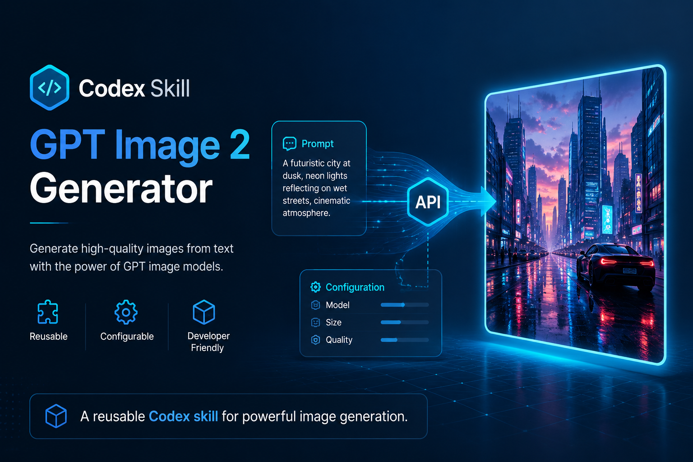

# GPT Image 2 Skill



Reusable Codex skill for generating images with `gpt-image-2`.

It works with both the official OpenAI API and OpenAI-compatible relay/proxy or middle-platform endpoints, as long as the Images API format is compatible and the endpoint actually exposes the `gpt-image-2` model.

The repo itself stays secret-safe: real `base_url` values are configured locally, and API keys are read from environment variables.

## Install The Skill

If you already have the Codex `skill-installer` helper:

```bash
python install-skill-from-github.py --repo KuanJia/gpt-image-2-skill --path skills/gpt-image-2-generator
```

Restart Codex after installation so it can discover the new skill.

## Configure Locally

Go into the installed skill directory and create a local config file:

```bash
python scripts/install_config.py --base-url https://your-endpoint.example/v1 --api-key-env OPENAI_API_KEY
```

This can be an OpenAI endpoint, or a compatible relay/middle-platform API that provides the `gpt-image-2` model.

Then set your API key:

```bash
export OPENAI_API_KEY="your_api_key"
```

On PowerShell:

```powershell
$env:OPENAI_API_KEY="your_api_key"
```

## Generate An Image

```bash
python scripts/generate_image.py --prompt "A scientific diagram of a pacemaker" --output output.png
```

## Published Skill

- Skill path: `skills/gpt-image-2-generator`
- Main instructions: `skills/gpt-image-2-generator/SKILL.md`
